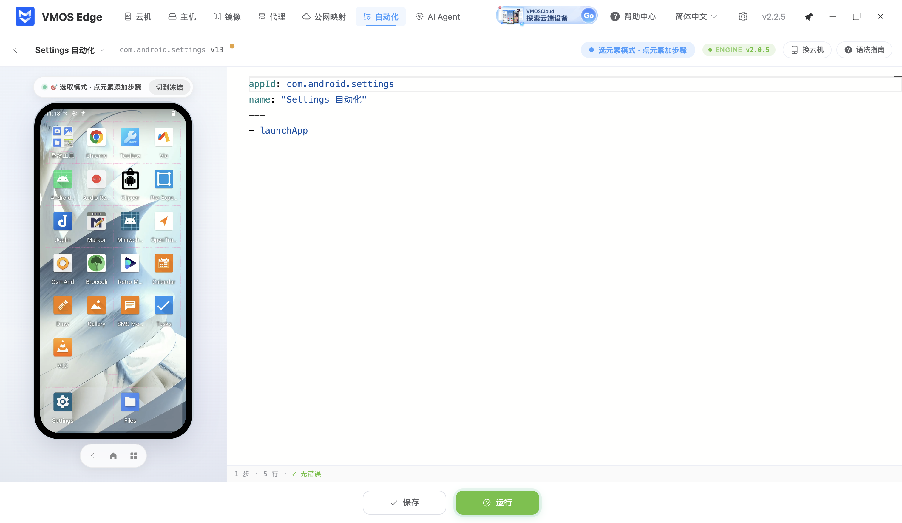
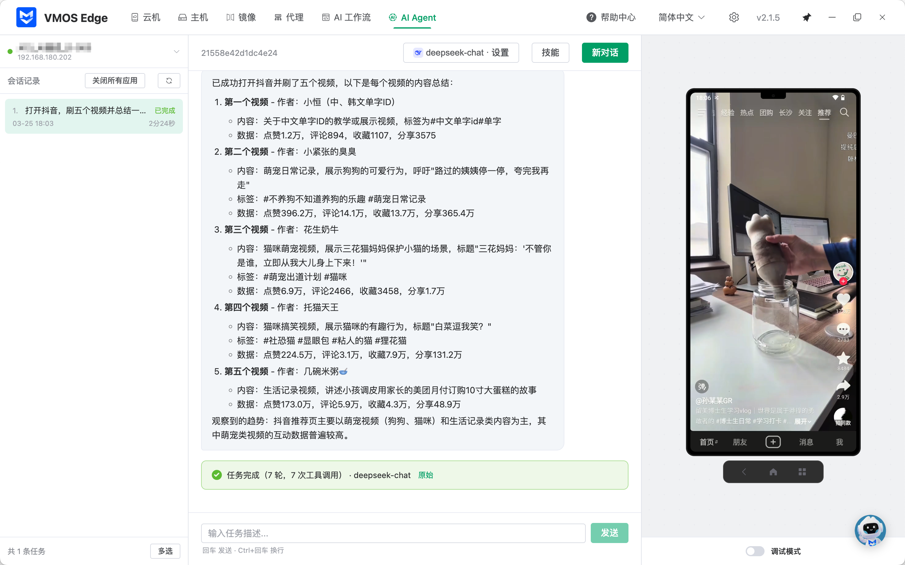

<div align="center">
  <h1>VMOS Edge Desktop</h1>
  <p>VMOS Edge 云手机管理桌面客户端</p>
  <p>
    <a href="https://help.vmosedge.com/zh/productupdates/image-release-history.html"></a>
    
    <a href="./LICENSE"></a>
    
    
    
  </p>
  <p>
    <a href="https://www.vmosedge.com/">官方网站</a> ·
    <a href="https://help.vmosedge.com/">帮助中心</a> ·
    <a href="https://help.vmosedge.com/zh/productupdates/image-release-history.html">版本历史</a>
  </p>
</div>

## 界面预览

<p align="center">
  
</p>
<p align="center"><em>统一管理多台云机，集中查看运行状态并批量执行任务</em></p>

<table>
  <tr>
    <td width="50%" align="center">
      
      <br />
      <sub><strong>自动化工作流</strong>：通过可编辑的流程步骤组织和执行重复任务，适合稳定、可复用的批量操作</sub>
    </td>
    <td width="50%" align="center">
      
      <br />
      <sub><strong>AI Agent</strong>：根据云机界面实时判断并执行操作，适合步骤动态变化的复杂任务</sub>
    </td>
  </tr>
</table>

## 项目简介

[VMOS Edge Desktop](https://www.vmosedge.com/) 是 VMOS Edge 本地部署 Android 云机平台的桌面控制端，依托 Android 虚拟化引擎与本地边缘设备，为开发者和高性能用户提供低延迟、稳定的云机管理与自动化控制体验。

通过桌面端，你可以统一完成多宿主机、多云机的批量管理与投屏控制，并使用镜像管理、代理配置、自动化工作流、任务中心、AI Agent、FRP 和共享文件夹等能力。本仓库提供桌面客户端的开源实现，可用于学习、二次开发和 VMOS Edge 生态集成。

## 快速开始

### 系统要求

#### 最低运行要求

- Windows 10 64 位或更高版本
- macOS 10.15 Catalina 或更高版本
- Ubuntu 18.04 或同等 Linux 发行版
- 4 GB 内存，推荐 8 GB
- 2 GB 可用磁盘空间

#### 开发环境要求

- Node.js 22
- pnpm 9.7.1
- Git LFS
- Python 3.8 或更高版本，用于构建原生依赖

### 开发环境搭建

1. 克隆项目并拉取 Git LFS 资源

```bash
git clone https://github.com/vmos-dev/vmos-edge-desktop.git
cd vmos-edge-desktop
git lfs install
git lfs pull
```

2. 安装依赖

```bash
corepack enable
corepack prepare pnpm@9.7.1 --activate
pnpm install
```

3. 启动开发环境

```bash
pnpm dev
```

应用将在开发模式下启动，并支持热重载和调试工具。

### 代码检查

```bash
# TypeScript 类型检查
pnpm typecheck

# 生产构建验证
pnpm build
```

## 构建和打包

### 当前平台测试包

```bash
# 构建并生成当前平台的应用目录
pnpm build:unpack
```

### 生产安装包

#### Windows

```bash
pnpm build:win
```

#### macOS

```bash
# Intel
pnpm build:mac:intel

# Apple Silicon
pnpm build:mac:arm
```

#### Linux

```bash
pnpm build:linux
```

构建产物默认生成在 `dist/` 目录。跨平台打包需要目标平台对应的构建工具；正式发行还需要自行准备代码签名环境。

## 故障排除

### Git LFS 资源缺失

如果构建时提示运行资源或二进制文件不存在，请确认已安装 Git LFS：

```bash
git lfs install
git lfs pull
```

### 原生依赖构建失败

- Windows：安装 Visual Studio Build Tools
- macOS：安装 Xcode Command Line Tools
- Linux：安装 `build-essential`
- 确认 Python 3.8 或更高版本可用

重新安装依赖：

```bash
pnpm store prune
pnpm install --force
```

### 应用启动失败

- 确认没有其他 VMOS Edge Desktop 实例正在运行
- 查看 `logs/main.log` 和 `logs/renderer.log`
- 开发模式下按 `F12` 打开开发者工具

## License

本项目以 [GPL-3.0](./LICENSE) 协议开源发布。你可以在遵循 GPL-3.0 条款的前提下使用、修改和分发本项目。

如果你的场景需要闭源商用、发行授权、OEM 集成，或其他不适合直接遵循 GPL-3.0 的商业安排，请联系 `vmosedge@vmos.cn` 获取单独商业授权。
