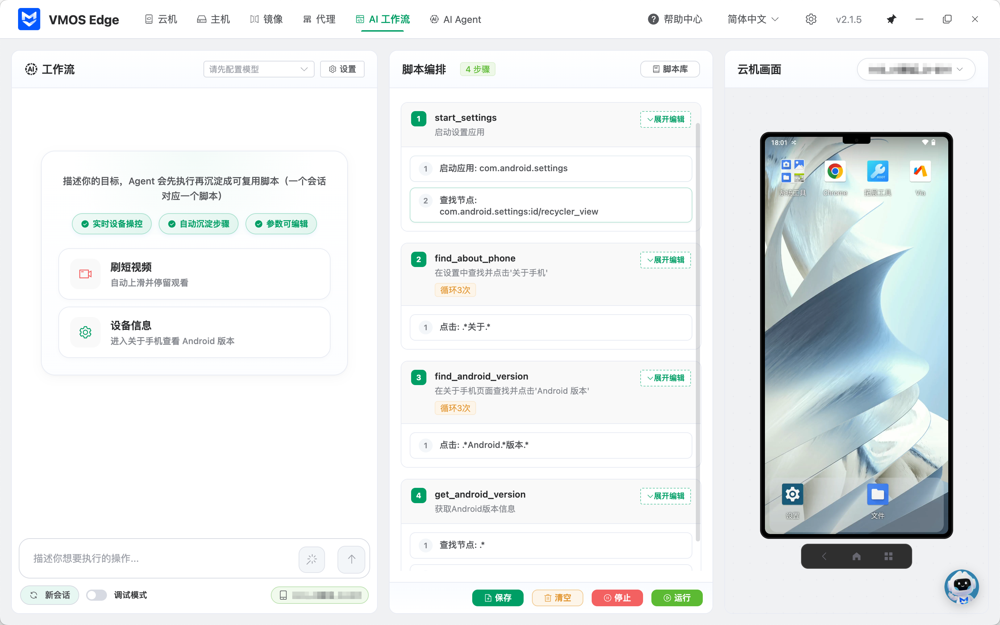

<div align="center">
  <h1>VMOS Edge Desktop</h1>
  <p>VMOS Edge云手机管理桌面客户端</p>
  <p>
    <a href="https://help.vmosedge.com/zh/productupdates/image-release-history.html"></a>
    
    <a href="./LICENSE"></a>
    
    
    
  </p>
  <p><a href="./README.md">简体中文</a> | <a href="./docs/README.en.md">English</a></p>
  <p>
    <a href="https://vmosedge.com">官方网站</a> ·
    <a href="https://help.vmosedge.com/zh/productupdates/image-release-history.html">版本历史</a> ·
    <a href="https://help.vmosedge.com/zh/sdk/agent-api.html">开发指南</a> ·
    <a href="https://help.vmosedge.com/zh/sdk/agent-api.html#_6-mcp-%E8%B0%83%E7%94%A8-ai-agent-%E9%9B%86%E6%88%90">AI集成</a>
  </p>
</div>

## 界面预览

<p align="center">
  
</p>
<p align="center"><em>AI 可面向多台云机统一下发任务，批量查看执行状态并集中处理结果</em></p>

<table>
  <tr>
    <td width="50%" align="center">
      
      <br />
      <sub><strong>AI 工作流</strong>：AI 先把任务拆解成脚本步骤，再按既定流程自动执行，适合固定流程的批量任务</sub>
    </td>
    <td width="50%" align="center">
      
      <br />
      <sub><strong>AI Agent</strong>：AI实时决策，执行时边看界面边判断并操作云机，适合变化较多的复杂任务</sub>
    </td>
  </tr>
</table>

## 项目简介

[VMOS Edge Desktop](https://vmosedge.com) 是 VMOS Edge 本地部署 Android 云机平台的桌面控制端，依托自研 Android 虚拟化引擎与本地盒子能力，为开发者和高性能用户提供低延迟、高稳定的云机管理与自动化控制体验。

通过桌面端，你可以统一完成多盒子、多云机的批量管理、投屏控制、镜像与主机管理，以及 AI 工作流、AI Agent 和 API 集成。本仓库提供该客户端的开源实现，适合用于学习、二次开发，以及围绕 VMOS Edge 能力进行集成。

## 快速开始

### 系统要求

#### 最低系统要求

- Windows: Windows 10 (64-bit) 或更高版本
- macOS: macOS 10.15 Catalina 或更高版本
- Linux: Ubuntu 18.04 或同等 Linux 发行版
- 内存: 4GB RAM (推荐 8GB)
- 存储: 2GB 可用磁盘空间

#### 开发环境要求

- Node.js: >= 18.0.0
- pnpm: >= 9.7.1 (推荐包管理器)
- Python: >= 3.8 (用于构建 native 依赖)

### 开发环境搭建

1. 克隆项目

```bash
git clone https://github.com/vmos-dev/vmos-edge-desktop.git
cd vmos-edge-desktop
```

2. 安装依赖

```bash
pnpm install
```

3. 启动开发服务器

```bash
pnpm dev
```

应用将在开发模式下启动，支持热重载和调试工具。

### 代码检查和格式化

```bash
# 代码格式化
pnpm format

# ESLint 检查
pnpm lint

# TypeScript 类型检查
pnpm typecheck
```

## 构建和打包

### 开发构建

```bash
# 构建但不打包 (用于测试)
pnpm build

# 构建并生成未打包的应用
pnpm build:unpack
```

### 生产构建

#### Windows 平台

```bash
# 构建 Windows 安装包 (.exe)
pnpm build:win
```

#### macOS 平台

```bash
# 构建 macOS Intel 版本 (.dmg)
pnpm build:mac:intel

# 构建 macOS Apple Silicon 版本 (.dmg)
pnpm build:mac:arm
```

#### Linux 平台

```bash
# 构建 Linux 安装包 (.AppImage, .deb)
pnpm build:linux
```

### 构建产物说明

构建完成后，安装包将生成在 `dist/` 目录中：

- Windows: `VMOS Edge Setup 2.1.5.exe`
- macOS: `VMOS Edge-2.1.5.dmg`
- Linux: `VMOS Edge-2.1.5.AppImage` / `vmos-edge-desktop_2.1.5_amd64.deb`

## 故障排除

### 常见问题

1. **安装依赖失败**

```bash
# 清除缓存并重新安装
pnpm store prune
rm -rf node_modules
pnpm install
```

2. **构建失败 (Native 依赖)**

- 确保系统已安装 Python 3.8+
- Windows: 安装 Visual Studio Build Tools
- macOS: 安装 Xcode Command Line Tools
- Linux: 安装 build-essential

3. **应用启动失败**

- 检查是否有其他实例正在运行
- 清除应用数据目录：`~/.vmos-edge-desktop`

### 调试技巧

- 开发模式下按 `F12` 打开开发者工具
- 主进程日志查看：`logs/main.log`
- 渲染进程日志查看：`logs/renderer.log`

## License

本项目默认以 [GPL-3.0](./LICENSE) 协议开源发布。你可以在遵循 GPL-3.0 条款的前提下使用、修改和分发本项目。

如果你的场景需要闭源商用、发行授权、OEM 集成，或其他不适合直接遵循 GPL-3.0 的商业安排，请联系 `vmosedge@vmos.cn` 获取单独商业授权。
